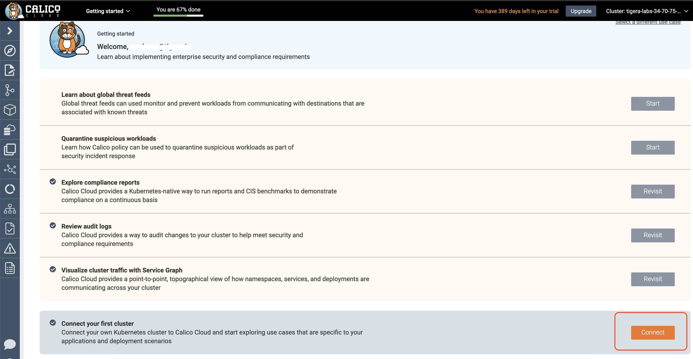
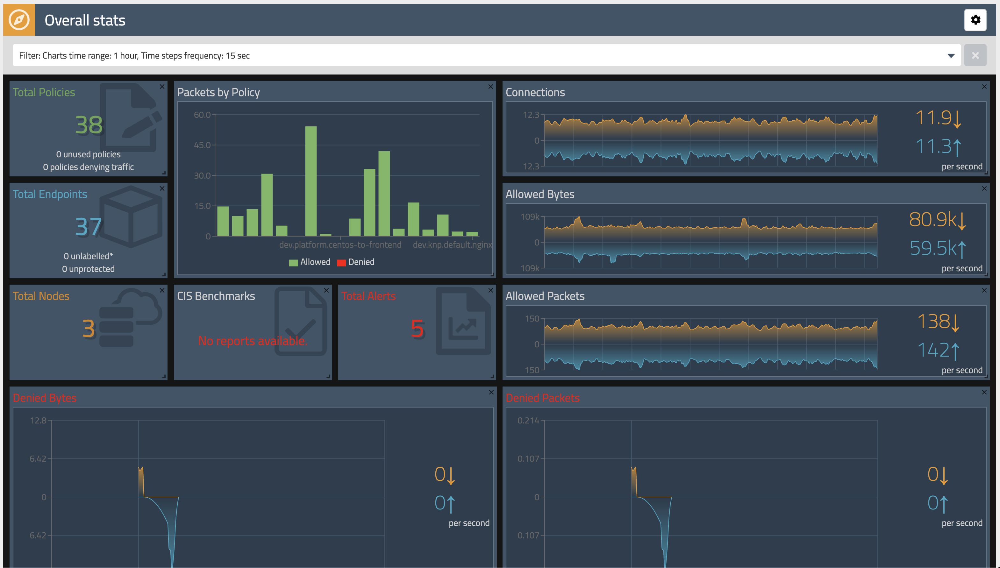
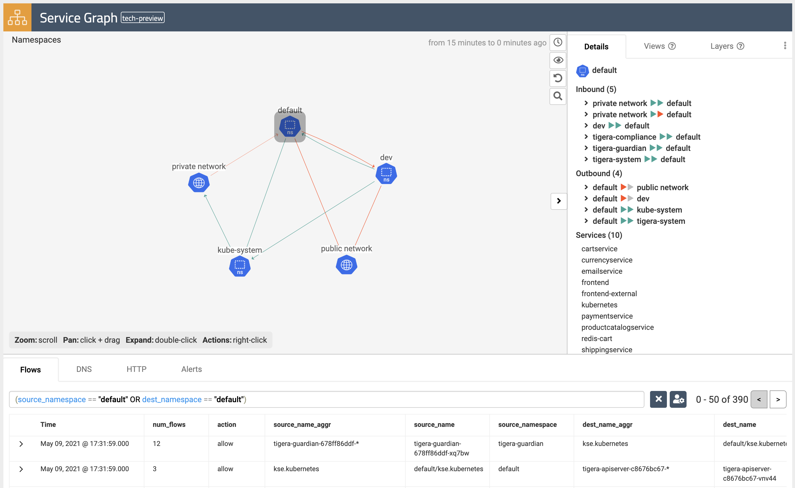

# calico-enterprise-eks-workshop

Kubernetes Security and Observability for EKS Workshop


# Module 2: Creating EKS cluster

**Goal:** Create EKS cluster.

This workshop uses EKS cluster with most of the default configuration settings.

> To create an EKS cluster and tune the default settings, consider exploring [EKS Workshop](https://www.eksworkshop.com) materials.

## Steps

Download and extract the latest release of eksctl with the following command

```bash
curl --silent --location "https://github.com/weaveworks/eksctl/releases/latest/download/eksctl_$(uname -s)_amd64.tar.gz" | tar xz -C /tmp
```

Move the extracted binary to /usr/local/bin.

```bash
sudo mv /tmp/eksctl /usr/local/bin
```

Test that your installation was successful with the following command

```bash
eksctl version
```

Download the vended kubectl binary for your cluster's Kubernetes version from Amazon S3

```bash
curl -o kubectl https://amazon-eks.s3.us-west-2.amazonaws.com/1.19.6/2021-01-05/bin/linux/amd64/kubectl
```

Check the SHA-256 sum for your downloaded binary

```bash
openssl sha1 -sha256 kubectl
```

Apply execute permissions to the binary

```bash
chmod +x ./kubectl
```

Create a $HOME/bin/kubectl and ensuring that $HOME/bin comes first in your $PATH

```bash
mkdir -p $HOME/bin && cp ./kubectl $HOME/bin/kubectl && export PATH=$PATH:$HOME/bin
```

Add $HOME/bin path to your shell initialization file so it's configured when opening shell

```bash
echo 'export PATH=$PATH:$HOME/bin' >> ~/.bashrc
```

After you install kubectl , you can verify its version with the following command

```bash
kubectl version --short --client
```


First, create an Amazon EKS cluster without any nodes

```bash
eksctl create cluster  --name tigera-workshop  --version 1.19  --with-oidc  --without-nodegroup
```

Delete the aws-node daemon set to disable AWS VPC networking for pods

```bash
kubectl delete daemonset -n kube-system aws-node
```

To configure the Calico CNI plugin, we must create an Install resource that has spec.cni.type

```bash
kubectl create -f https://docs.tigera.io/manifests/eks/custom-resources-calico-cni.yaml
```

Finally, add nodes to the cluster

```bash
eksctl create nodegroup --cluster tigera-workshop --node-type t3.xlarge  --nodes 3 --nodes-min 0 --nodes-max 3 --node-ami auto --max-pods-per-node 58
```

Alternatively, we can just create a cluster using the default AWS VPC CNI:

```bash
eksctl create cluster  --name tigera-workshop  --version 1.19  --with-oidc --node-type t3.xlarge  --nodes 3 --nodes-min 0 --nodes-max 3 --node-ami auto --max-pods-per-node 58
```


This bypasses the need to removing the cluster node group > removing the aws-node daemonset > installing the Calico CNI > and finally creating a supported node group for your cluster.

> Please note: This might take 8-10 cycles/minutes for CloudFormation to finish cluster deployment:


On completion, you can view your EKS cluster by running the below `eksctl` command:

```bash
eksctl get cluster tigera-workshop
```


# Module 3: Joining EKS cluster to Calico Cloud

**Goal:** Join EKS cluster to Calico Cloud management plane.

> In order to complete this module, you must have [Calico Cloud trial account](https://www.tigera.io/tigera-products/calico-cloud/).




## Steps

1. Join EKS cluster to Calico Cloud management plane.

    Use Calico Cloud install script provided in the welcome email for Calico Cloud trial account.

    ```bash
    # script should look similar to this
    curl https://installer.calicocloud.io/xxxxxx_yyyyyyy-saay-management_install.sh | bash
    ```

    Joining the cluster to Calico Cloud can take a few minutes. Wait for the installation script to finish before you proceed to the next step.

    You should see the output similar to this:

    

1. Configure log aggregation and flush intervals.

    ```bash
    kubectl patch felixconfiguration.p default -p '{"spec":{"flowLogsFlushInterval":"10s"}}'
    kubectl patch felixconfiguration.p default -p '{"spec":{"dnsLogsFlushInterval":"10s"}}'
    kubectl patch felixconfiguration.p default -p '{"spec":{"flowLogsFileAggregationKindForAllowed":1}}'
    ```

    

1. Configure Felix for log data collection.

    > [Felix](https://docs.tigera.io/reference/architecture/overview#felix) is one of Calico components that is responsible for configuring routes, ACLs, and anything else required on the host to provide desired connectivity for the endpoints on that host.

    ```bash
    kubectl patch felixconfiguration default --type='merge' -p '{"spec":{"policySyncPathPrefix":"/var/run/nodeagent","l7LogsFileEnabled":true}}'
    ```

# Module 4: Configuring demo applications

**Goal:** Deploy and configure demo applications.

## Steps

1. Deploy policy tiers.

    We are going to deploy some policies into policy tier to take advantage of hierarcical policy management.

    ```bash
    cat << EOF > tiers.yaml
    ---
    apiVersion: projectcalico.org/v3
    kind: Tier
    metadata:
      name: security
    spec:
      order: 400

    ---
    apiVersion: projectcalico.org/v3
    kind: Tier
    metadata:
      name: platform
    spec:
      order: 500
    EOF
    ```

    ```bash
    kubectl apply -f https://raw.githubusercontent.com/n1g3ld0uglas/calico-enterprise-eks-workshop/main/policies/tiers.yaml
    ```

    

    

    This will add tiers `security` and `platform` to the Calico cluster.

1. Deploy base policy.

    In order to explicitly allow workloads to connect to the Kubernetes DNS component, we are going to implement a policy that controls such traffic.

    ```bash
    cat << EOF > allow-kube-dns.yaml
    apiVersion: projectcalico.org/v3
    kind: GlobalNetworkPolicy
    metadata:
      name: platform.allow-kube-dns
    spec:
      # requires platform tier to exist
      tier: platform
      order: 2000
      selector: all()
      types:
      - Egress
      egress:
      - action: Allow
        protocol: UDP
        source: {}
        destination:
          selector: "k8s-app == 'kube-dns'"
          ports:
          - '53'
      - action: Pass
        source: {}
        destination: {}
    EOF
    ```

    Apply the file

    ```bash
    kubectl apply -f https://raw.githubusercontent.com/n1g3ld0uglas/calico-enterprise-eks-workshop/main/policies/allow-kube-dns.yaml
    ```

    At this point, we have created our 1st network policy to allow traffic for Kube-DNS (based solely on label selection):

    

1. Deploy demo applications.

    ```bash
    kubectl apply -f https://raw.githubusercontent.com/tigera-solutions/tigera-eks-workshop/main/demo/dev/app.manifests.yaml
    ```

    ```bash
    kubectl apply -f https://raw.githubusercontent.com/GoogleCloudPlatform/microservices-demo/master/release/kubernetes-manifests.yaml
    ```

    After running the above 3 commands, you should have the demo application up-and-running:

    

1. Deploy compliance reports.

    > The reports will be needed for one of a later lab.

    ```yaml
    apiVersion: projectcalico.org/v3
    kind: GlobalReport
    metadata:
      name: daily-cis-results
      labels:
        deployment: production
    spec:
      reportType: cis-benchmark
      schedule: 0 0 * * *
      cis:
        highThreshold: 100
        medThreshold: 50
        includeUnscoredTests: true
        numFailedTests: 5
    ```

    ```bash
    kubectl apply -f https://raw.githubusercontent.com/tigera-solutions/tigera-eks-workshop/main/demo/40-compliance-reports/daily-cis-results.yaml
    ```

    ```yaml
    ---
    apiVersion: projectcalico.org/v3
    kind: GlobalReport
    metadata:
      name: cluster-inventory
    spec:
      reportType: inventory
      schedule: '*/30 * * * *'

    ---
    apiVersion: projectcalico.org/v3
    kind: GlobalReport
    metadata:
      name: cluster-network-access
    spec:
      reportType: network-access
      schedule: '*/30 * * * *'

    # uncomment policy-audit report if you configured audit logs for EKS cluster https://docs.tigera.io/visibility/elastic/ee-audit#enable-audit-logs-in-eks
    # ---
    # apiVersion: projectcalico.org/v3
    # kind: GlobalReport
    # metadata:
    #   name: cluster-policy-audit
    # spec:
    #   reportType: policy-audit
    #   schedule: '*/30 * * * *'
    ```

    ```bash
    kubectl apply -f https://raw.githubusercontent.com/tigera-solutions/tigera-eks-workshop/main/demo/40-compliance-reports/cluster-reports.yaml
    ```

1. Deploy global alerts.

    > The alerts will be explored later on in the workshop.

    ```yaml
    ---
    apiVersion: projectcalico.org/v3
    kind: GlobalAlertTemplate
    metadata:
      name: policy.globalnetworkset
    spec:
      description: "Alerts on any changes to global network sets"
      summary: "[audit] [privileged access] change detected for ${objectRef.resource} ${objectRef.name}"
      severity: 100
      period: 5m
      lookback: 5m
      dataSet: audit
      # alert is triggered if CRUD operation executed against any globalnetworkset
      query: (verb=create OR verb=update OR verb=delete OR verb=patch) AND "objectRef.resource"=globalnetworksets
      aggregateBy: [objectRef.resource, objectRef.name]
      metric: count
      condition: gt
      threshold: 0

    ---
    apiVersion: projectcalico.org/v3
    kind: GlobalAlert
    metadata:
      name: policy.globalnetworkset
    spec:
      description: "Alerts on any changes to global network sets"
      summary: "[audit] [privileged access] change detected for ${objectRef.resource} ${objectRef.name}"
      severity: 100
      period: 1m
      lookback: 1m
      dataSet: audit
      # alert is triggered if CRUD operation executed against any globalnetworkset
      query: (verb=create OR verb=update OR verb=delete OR verb=patch) AND "objectRef.resource"=globalnetworksets
      aggregateBy: [objectRef.resource, objectRef.name]
      metric: count
      condition: gt
      threshold: 0
    ```

    ```bash
    kubectl apply -f https://raw.githubusercontent.com/tigera-solutions/tigera-eks-workshop/main/demo/50-alerts/globalnetworkset.changed.yaml
    ```

    ```yaml
    ---
    apiVersion: projectcalico.org/v3
    kind: GlobalAlertTemplate
    metadata:
      name: dns.unsanctioned.access
    spec:
      description: "Pod attempted to access restricted.com domain"
      summary: "[dns] pod ${client_namespace}/${client_name_aggr} attempted to access '${qname}'"
      severity: 100
      dataSet: dns
      period: 5m
      lookback: 5m
      query: '(qname = "www.restricted.com" OR qname = "restricted.com")'
      aggregateBy: [client_namespace, client_name_aggr, qname]
      metric: count
      condition: gt
      threshold: 0

    ---
    apiVersion: projectcalico.org/v3
    kind: GlobalAlert
    metadata:
      name: dns.unsanctioned.access
    spec:
      description: "Pod attempted to access google.com domain"
      summary: "[dns] pod ${client_namespace}/${client_name_aggr} attempted to access '${qname}'"
      severity: 100
      dataSet: dns
      period: 1m
      lookback: 1m
      query: '(qname = "www.google.com" OR qname = "google.com")'
      aggregateBy: [client_namespace, client_name_aggr, qname]
      metric: count
      condition: gt
      threshold: 0
    ```

    ```bash
    kubectl apply -f https://raw.githubusercontent.com/tigera-solutions/tigera-eks-workshop/main/demo/50-alerts/unsanctioned.dns.access.yaml
    ```

    ```yaml
    ---
    apiVersion: projectcalico.org/v3
    kind: GlobalAlertTemplate
    metadata:
      name: network.lateral.access
    spec:
      description: "Alerts when pods with a specific label (security=strict) accessed by other workloads from other namespaces"
      summary: "[flows] [lateral movement] ${source_namespace}/${source_name_aggr} has accessed ${dest_namespace}/${dest_name_aggr} with label security=strict"
      severity: 100
      period: 5m
      lookback: 5m
      dataSet: flows
      query: '"dest_labels.labels"="security=strict" AND "dest_namespace"="secured_pod_namespace" AND "source_namespace"!="secured_pod_namespace" AND proto=tcp AND (("action"="allow" AND ("reporter"="dst" OR "reporter"="src")) OR ("action"="deny" AND "reporter"="src"))'
      aggregateBy: [source_namespace, source_name_aggr, dest_namespace, dest_name_aggr]
      field: num_flows
      metric: sum
      condition: gt
      threshold: 0

    ---
    apiVersion: projectcalico.org/v3
    kind: GlobalAlert
    metadata:
      name: network.lateral.access
    spec:
      description: "Alerts when pods with a specific label (security=strict) accessed by other workloads from other namespaces"
      summary: "[flows] [lateral movement] ${source_namespace}/${source_name_aggr} has accessed ${dest_namespace}/${dest_name_aggr} with label security=strict"
      severity: 100
      period: 1m
      lookback: 1m
      dataSet: flows
      query: '("dest_labels.labels"="security=strict" AND "dest_namespace"="dev") AND "source_namespace"!="dev" AND "proto"="tcp" AND (("action"="allow" AND ("reporter"="dst" OR "reporter"="src")) OR ("action"="deny" AND "reporter"="src"))'
      aggregateBy: [source_namespace, source_name_aggr, dest_namespace, dest_name_aggr]
      field: num_flows
      metric: sum
      condition: gt
      threshold: 0
    ```

    ```bash
    kubectl apply -f https://raw.githubusercontent.com/tigera-solutions/tigera-eks-workshop/main/demo/50-alerts/unsanctioned.lateral.access.yaml
    ```

    For this section, we simply ran some `kubectl apply` commands in order to create our global alerts and scheduling compliance reports:

    

# Module 5: Using security controls

**Goal:** Leverage network policies to segment connections within Kubernetes cluster and prevent known bad actors from accessing the workloads.

## Steps

1. Test connectivity between application components and across application stacks.

    a. Test connectivity between workloads within each namespace.

    Test connectivity within dev namespace

    ```bash
    kubectl -n dev exec -t centos -- sh -c 'curl -m3 -sI http://nginx-svc 2>/dev/null | grep -i http'
    ```

    Test connectivity within default namespace

    ```bash
    kubectl exec -it $(kubectl get po -l app=loadgenerator -ojsonpath='{.items[0].metadata.name}') -- sh -c 'curl -m3 -sI frontend 2>/dev/null | grep -i http'
    ```

    Test connectivity with product catalog service (work in progress)

    ```bash
    kubectl exec -it $(kubectl get po -l app=frontend -ojsonpath='{.items[0].metadata.name}') -c server -- sh -c 'nc -zv productcatalogservice 3550'
    ```

    

    b. Test connectivity across namespaces.

    Test connectivity from dev namespace to default namespace

    ```bash
    kubectl -n dev exec -t centos -- sh -c 'curl -m3 -sI http://frontend.default 2>/dev/null | grep -i http'
    ```

    Test connectivity from default namespace to dev namespace

    ```bash
    kubectl exec -it $(kubectl get po -l app=loadgenerator -ojsonpath='{.items[0].metadata.name}') -- sh -c 'curl -m3 -sI http://nginx-svc.dev 2>/dev/null | grep -i http'
    ```

    

    c. Test connectivity from each namespace to the Internet.

    Test connectivity from dev namespace to the Internet

    ```bash
    kubectl -n dev exec -t centos -- sh -c 'curl -m3 -sI http://www.google.com 2>/dev/null | grep -i http'
    ```

    Test connectivity from default namespace to the Internet
    ```bash
    kubectl exec -it $(kubectl get po -l app=loadgenerator -ojsonpath='{.items[0].metadata.name}') -- sh -c 'curl -m3 -sI www.google.com 2>/dev/null | grep -i http'
    ```

    

    All of these tests should succeed if there are no policies in place to govern the traffic for `dev` and `default` namespaces.

1. Apply staged `default-deny` policy.

    > Staged `default-deny` policy is a good way of catching any traffic that is not explicitly allowed by a policy without explicitly blocking it.

    ```yaml
    apiVersion: projectcalico.org/v3
    kind: StagedGlobalNetworkPolicy
    metadata:
      name: default-deny
    spec:
      order: 2000
      selector: "projectcalico.org/namespace in {'dev','default'}"
      types:
      - Ingress
      - Egress
    ```

    Apply the below command

    ```bash
    kubectl apply -f https://raw.githubusercontent.com/n1g3ld0uglas/calico-enterprise-eks-workshop/main/policies/default-deny.yaml
    ```

    The output should look something like this..

    

    You should be able to view the potential affect of the staged `default-deny` policy if you navigate to the `Dashboard` view in the Enterprise Manager UI and look at the `Packets by Policy` histogram.

    

    ```bash
    # make a request across namespaces and view Packets by Policy histogram
    for i in {1..10}; do kubectl -n dev exec -t centos -- sh -c 'curl -m3 -sI http://frontend.default 2>/dev/null | grep -i http'; sleep 2; done
    ```

    > The staged policy does not affect the traffic directly but allows you to view the policy impact if it were to be enforced.

1. Apply network policies to control East-West traffic.

    Deploy dev policies

    ```bash
    kubectl apply -f https://raw.githubusercontent.com/tigera-solutions/tigera-eks-workshop/main/demo/dev/policies.yaml
    ```

    Deploy boutiqueshop policies

    ```bash
    kubectl apply -f https://raw.githubusercontent.com/tigera-solutions/tigera-eks-workshop/main/demo/boutiqueshop/policies.yaml
    ```

    

    

    Now as we have proper policies in place, we can enforce `default-deny` policy moving closer to zero-trust security approach. You can either enforced the already deployed staged `default-deny` policy using the `Policies Board` view in the Enterirpse Manager UI, or you can apply an enforcing `default-deny` policy manifest.

    After enforcing default-deny policy manifest

    ```bash
    kubectl apply -f https://raw.githubusercontent.com/n1g3ld0uglas/calico-enterprise-eks-workshop/main/policies/default-deny2.yaml
    ```

    You can delete staged default-deny policy

    ```
    kubectl delete -f https://raw.githubusercontent.com/n1g3ld0uglas/calico-enterprise-eks-workshop/main/policies/default-deny.yaml
    ```

    

1. Test connectivity with policies in place.

    a. The only connections between the components within each namespaces should be allowed as configured by the policies.

    Test connectivity within dev namespace

    ```bash
    kubectl -n dev exec -t centos -- sh -c 'curl -m3 -sI http://nginx-svc 2>/dev/null | grep -i http'
    ```

    Test connectivity within default namespace

    ```bash
    kubectl exec -it $(kubectl get po -l app=loadgenerator -ojsonpath='{.items[0].metadata.name}') -- sh -c 'curl -m3 -sI frontend 2>/dev/null | grep -i http'
    ```

    b. The connections across `dev` and `default` namespaces should be blocked by the global `default-deny` policy.

    Test connectivity from dev namespace to default namespace

    ```bash
    kubectl -n dev exec -t centos -- sh -c 'curl -m3 -sI http://frontend.default 2>/dev/null | grep -i http'
    ```

    Test connectivity from default namespace to dev namespace

    ```bash
    kubectl exec -it $(kubectl get po -l app=loadgenerator -ojsonpath='{.items[0].metadata.name}') -- sh -c 'curl -m3 -sI http://nginx-svc.dev 2>/dev/null | grep -i http'
    ```

    

    c. The connections to the Internet should be blocked by the configured policies.

    Test connectivity from dev namespace to the Internet

    ```bash
    kubectl -n dev exec -t centos -- sh -c 'curl -m3 -sI http://www.google.com 2>/dev/null | grep -i http'
    ```

    Test connectivity from default namespace to the Internet

    ```bash
    kubectl exec -it $(kubectl get po -l app=loadgenerator -ojsonpath='{.items[0].metadata.name}') -- sh -c 'curl -m3 -sI www.google.com 2>/dev/null | grep -i http'
    ```

    

1. Protect workloads from known bad actors.

    Calico offers `GlobalThreatfeed` resource to prevent known bad actors from accessing Kubernetes pods.

    Deploy feodo tracker threatfeed

    ```bash
    kubectl apply -f https://raw.githubusercontent.com/tigera-solutions/tigera-eks-workshop/main/demo/10-security-controls/feodotracker.threatfeed.yaml
    ```

    

    Deploy network policy that uses the threatfeed

    ```bash
    kubectl apply -f https://raw.githubusercontent.com/tigera-solutions/tigera-eks-workshop/main/demo/10-security-controls/feodo-block-policy.yaml
    ```

    Try to ping any of the IPs in from the feodo tracker list

    ```bash
    IP=$(kubectl get globalnetworkset threatfeed.feodo-tracker -ojson | jq .spec.nets[0] | sed -e 's/^"//' -e 's/"$//' -e 's/\/32//')
    ```

    Try pinging the IP address associated with the threat feed:

    ```bash
    kubectl -n dev exec -t centos -- sh -c "ping -c1 $IP"
    ```

# Module 6: Using egress access controls

**Goal:** Configure egress access for specific workloads.

## Steps

1. Test connectivity within the cluster and to the external endpoint.

    a. Test connectivity between `dev/centos` pod and `default/frontend` pod.

    ```bash
    # test connectivity from dev namespace to default namespace
    kubectl -n dev exec -t centos -- sh -c 'curl -m3 -sI http://frontend.default 2>/dev/null | grep -i http'
    ```

    b. Test connectivity from `dev/centos` to the external endpoint.

    ```bash
    # test connectivity from dev namespace to the Internet
    kubectl -n dev exec -t centos -- sh -c 'curl -m3 -sI http://www.google.com 2>/dev/null | grep -i http'
    ```

    The access should be denied as the policies configured in previous module do not allow it.

1. Implement egress policy to allow egress access from a workload in one namespace, e.g. `dev/centos`, to a service in another namespace, e.g. `default/frontend`.

    a. Deploy egress policy.

    ```bash
    kubectl apply -f https://raw.githubusercontent.com/tigera-solutions/tigera-eks-workshop/main/demo/20-egress-access-controls/centos-to-frontend.yaml
    ```

    b. Test connectivity between `dev/centos` pod and `default/frontend` service.

    ```bash
    kubectl -n dev exec -t centos -- sh -c 'curl -m3 -sI http://frontend.default 2>/dev/null | grep -i http'
    ```

    The access should be allowed once the egress policy is in place.

    

1. Implement DNS policy to allow the external endpoint access from a specific workload, e.g. `dev/centos`.

    a. Apply a policy to allow access to `api.twilio.com` endpoint using DNS rule.

    Deploy dns policy

    ```bash
    kubectl apply -f https://raw.githubusercontent.com/tigera-solutions/tigera-eks-workshop/main/demo/20-egress-access-controls/dns-policy.yaml
    ```

    Test egress access to api.twilio.com

    ```bash
    kubectl -n dev exec -t centos -- sh -c 'curl -m3 -skI https://api.twilio.com 2>/dev/null | grep -i http'
    ```

    Test egress access to www.google.com

    ```bash
    kubectl -n dev exec -t centos -- sh -c 'curl -m3 -skI https://www.google.com 2>/dev/null | grep -i http'
    ```

    

    Access to the `api.twilio.com` endpoint should be allowed by the DNS policy but not to any other external endpoints like `www.google.com` unless we modify the policy to include that domain name.

    b. Edit the policy to use a `NetworkSet` instead of inline DNS rule.

    Deploy network set

    ```bash
    kubectl apply -f https://raw.githubusercontent.com/tigera-solutions/tigera-eks-workshop/main/demo/20-egress-access-controls/netset.external-apis.yaml
    ```

    Deploy DNS policy using the network set

    ```bash
    kubectl apply -f https://raw.githubusercontent.com/tigera-solutions/tigera-eks-workshop/main/demo/20-egress-access-controls/dns-policy.netset.yaml
    ```

    

    > As a bonus example, you can modify the `external-apis` network set to include `*.google.com` domain name which would allow access to Google subdomains. If you do it, you can would allow acess to subdomains like `www.google.com`, `docs.google.com`, etc.

# Module 7: Zone-Based Architecture

Introduce a new application into your test cluster:

```bash
kubectl apply -f https://installer.calicocloud.io/storefront-demo.yaml
```

Create a tier for the new zone-based policies:

```bash
kubectl apply -f https://raw.githubusercontent.com/n1g3ld0uglas/CCSecOps/main/Tiers/storefront.yaml
```

Following steps are very similar to [Hands-On-Workshop-Cyber-Threat-Protection-Strategies-Tactics-for-Kubernetes](https://github.com/tigera-solutions/Hands-On-Workshop-Cyber-Threat-Protection-Strategies-Tactics-for-Kubernetes) scenario, although relying on the different tier naming.

Download DMZ configuration, change target tier and `StagedNetworkPolicy` name, apply

```bash
curl -O https://raw.githubusercontent.com/tigera-solutions/Hands-On-Workshop-Cyber-Threat-Protection-Strategies-Tactics-for-Kubernetes/main/zba/dmz.yaml
sed -i 's/developer/storefront/' dmz.yaml
kubectl apply -f dmz.yaml
```

Establish Trusted Zone, adjust naming convention first

```bash
curl -O https://raw.githubusercontent.com/tigera-solutions/Hands-On-Workshop-Cyber-Threat-Protection-Strategies-Tactics-for-Kubernetes/main/zba/trusted.yaml
sed -i 's/developer/storefront/' trusted.yaml
kubectl apply -f trusted.yaml
```

Establish Restricted Zone, adjust naming convention first

```bash
curl -O https://raw.githubusercontent.com/tigera-solutions/Hands-On-Workshop-Cyber-Threat-Protection-Strategies-Tactics-for-Kubernetes/main/zba/restricted.yaml
sed -i 's/developer/storefront/' restricted.yaml
kubectl apply -f restricted.yaml
```

Now you should see three new staged policies inside the `storefront` tier


# Module 8: Policy Recommendations

# Module 9: Securing EKS hosts

**Goal:** Secure EKS hosts ports with network policies.

Calico network policies not only can secure pod to pod communications but also can be applied to EKS hosts to protect host based services and ports. For more details refer to [Protect Kubernetes nodes](https://docs.tigera.io/security/kubernetes-nodes) documentaiton.

## Steps

I'm building this scenario around a generic 3 node cluster - master, worker and etcd node:


Automatically register your nodes as Host Endpoints (HEPS). To enable automatic host endpoints, edit the default `KubeControllersConfiguration` instance, and set `spec.controllers.node.hostEndpoint.autoCreate` to true:

```bash
kubectl patch kubecontrollersconfiguration default --patch='{"spec": {"controllers": {"node": {"hostEndpoint": {"autoCreate": "Enabled"}}}}}'
```


to add the label kubernetes-host to all nodes and their host endpoints:

```bash
kubectl label nodes --all kubernetes-host=
```


This tutorial assumes that you already have a tier called 'rancher-nodes' in Calico Cloud:

```bash
cat << EOF > rancher-nodes.yaml
apiVersion: projectcalico.org/v3
kind: Tier
metadata:
  name: rancher-nodes
spec:
  order: 350
EOF
```

```bash
kubectl apply -f rancher-nodes.yaml
```


# etcd-nodes

Once the tier is created, build a policy for the ETCD nodes:

```bash
cat << EOF > etcd-nodes.yaml
apiVersion: projectcalico.org/v3
kind: StagedGlobalNetworkPolicy
metadata:
  name: rancher-nodes.etcd-nodes
spec:
  tier: rancher-nodes
  order: 0
  selector: has(kubernetes-host) && environment == 'etcd'
  namespaceSelector: ''
  serviceAccountSelector: ''
  ingress:
    - action: Allow
      protocol: TCP
      source: {}
      destination:
        ports:
          - '2376'
          - '2379'
          - '2380'
          - '9099'
          - '10250'
    - action: Allow
      protocol: UDP
      source: {}
      destination:
        ports:
          - '8472'
  egress:
    - action: Allow
      protocol: TCP
      source: {}
      destination:
        ports:
          - '443'
          - '2379'
          - '2380'
          - '6443'
          - '9099'
    - action: Allow
      protocol: UDP
      source: {}
      destination:
        ports:
          - '8472'
  doNotTrack: false
  applyOnForward: false
  preDNAT: false
  types:
    - Ingress
    - Egress
EOF
```

```bash
kubectl apply -f etcd-nodes.yaml
```


# Control-plane-nodes (Master Node)

Now proceed to build a policy for the master nodes:

```bash
cat << EOF > control-plane-nodes.yaml
apiVersion: projectcalico.org/v3
kind: StagedGlobalNetworkPolicy
metadata:
  name: rancher-nodes.control-plane-nodes
spec:
  tier: rancher-nodes
  order: 100
  selector: has(kubernetes-host) && environment == 'master'
  namespaceSelector: ''
  serviceAccountSelector: ''
  ingress:
    - action: Allow
      protocol: TCP
      source: {}
      destination:
        ports:
          - '80'
          - '443'
          - '2376'
          - '6443'
          - '9099'
          - '10250'
    - action: Allow
      protocol: UDP
      source: {}
      destination:
        ports:
          - '8472'
  egress:
    - action: Allow
      protocol: TCP
      source: {}
      destination:
        ports:
          - '443'
          - '2379'
          - '2380'
          - '9099'
          - '10250'
          - '10254'
    - action: Allow
      protocol: UDP
      source: {}
      destination:
        ports:
          - '8472'
  doNotTrack: false
  applyOnForward: false
  preDNAT: false
  types:
    - Ingress
    - Egress
EOF
```

```bash
kubectl apply -f control-plane-nodes.yaml
```


# worker-nodes

Finally, we can build a policy for the worker nodes:

```bash
cat << EOF > worker-nodes.yaml
apiVersion: projectcalico.org/v3
kind: StagedGlobalNetworkPolicy
metadata:
  name: rancher-nodes.worker-nodes
spec:
  tier: rancher-nodes
  order: 200
  selector: has(kubernetes-host) && environment == 'worker'
  namespaceSelector: ''
  serviceAccountSelector: ''
  ingress:
    - action: Allow
      protocol: TCP
      source: {}
      destination:
        ports:
          - '22'
          - '3389'
          - '80'
          - '443'
          - '2376'
          - '9099'
          - '10250'
          - '10254'
    - action: Allow
      protocol: UDP
      source: {}
      destination:
        ports:
          - '8472'
  egress:
    - action: Allow
      protocol: TCP
      source: {}
      destination:
        ports:
          - '443'
          - '6443'
          - '9099'
          - '10254'
    - action: Allow
      protocol: UDP
      source: {}
      destination:
        ports:
          - '8472'
  doNotTrack: false
  applyOnForward: false
  preDNAT: false
  types:
    - Ingress
    - Egress
EOF
```

```bash
kubectl apply -f worker-nodes.yaml
```


# Label based on node purpose

To select a specific set of host endpoints (and their corresponding Kubernetes nodes), use a policy selector that selects a label unique to that set of host endpoints. For example, if we want to add the label `environment=dev` to nodes named node1 and node2:

```bash
kubectl label node ip-10-0-1-165 environment=master
kubectl label node ip-10-0-1-167 environment=worker
kubectl label node ip-10-0-1-227 environment=etcd
```


Once correctly labeled, you can see the policy applying to each host endpoint:


Alternatively, you can build a policy for worker nodes access to localhost:

```bash
kubectl apply -f - << EOF
apiVersion: projectcalico.org/v3
kind: GlobalNetworkPolicy
metadata:
  name: ingress-k8s-workers
spec:
  selector: has(kubernetes-worker)
  # Allow all traffic to localhost.
  ingress:
  - action: Allow
    destination:
      nets:
      - 127.0.0.1/32
  # Allow only the masters access to the nodes kubelet API.
  - action: Allow
    protocol: TCP
    source:
      selector: has(node-role.kubernetes.io/master)
    destination:
      ports:
      - 10250
EOF
```

# Module 10: Using observability tools

**Goal:** Explore Calico observability tools.

## Calico observability tools

> If you are interested in enabling collection of application layer metrics for your workloads, refer to [Configure L7 logs](https://docs.tigera.io/visibility/elastic/l7/configure) documentation to enable application layer metrics collection.

1. Dashboard

    The `Dashboard` view in the Enterprise Manager UI presents high level overview of what's going on in your cluster. The view shows the following information:

    - Connections, Allowed Bytes and Packets
    - Denied Bytes and Packets
    - Total number of Policies, Endpoints and Nodes
    - Summary of CIS benchmarks
    - Count of triggered alerts
    - Packets by Policy histogram that shows allowed and denied traffic as it is being evaluated by network policies

   

1. Policies Board

    The `Policies Board` shows all policies deployed in the cluster and organized into `policy tiers`. You can control what a user can see and do by configuring Kubernetes RBAC roles which determine what the user can see in this view. You can also use controls to hide away tiers you're not interested in at any given time.

    

    By leveraging stats controls you can toggle additional metrics to be listed for each shown policy.

    

1. Audit timeline

    The `Timeline` view shows audit trail of created, deleted, or modified resources.

    

1. Endpoints

    The `Endpoints` view lists all endpoints known to Calico. It includes all Kubernetes endpoints, such as Pods, as well as Host endpoints that can represent a Kubernetes host or an external VM or bare metal machine.

    

1. Service Graph

    The dynamic `Service Graph` presents network flows from service level perspective. Top level view shows how traffic flows between namespaces as well as external and internal endpoints.

    

    - When you select any node representing a namespace, you will get additional details about the namespace, such as incoming and outgoing traffic, policies evaluating each flow, and DNS metrics.
    - When you select any edge, you will get details about the flows representing that edge.
    - If you expand a namespace by double-clicking on it, you will get the view of all components of the namespace.

1. Flow Visualizations

    The `Flow Visualizations` view shows all point-to-point flows in the cluster. It allows you to see the cluster traffic from the network point of view.

    

1. Kibana dashboards

    The `Kibana` components comes with Calico commercial offerings and provides you access to raw flow, audit, and dns logs, as well as ability to visualize the collected data in various dashboards.

    

    Some of the default dashboards you get access to are DNS Logs, Flow Logs, Audit Logs, Kuernetes API calls, L7 HTTP metrics, and others.

# Module 11: Using compliance reports

**Goal:** Use global reports to satisfy compliance requirements.

## Steps

1. Use `Compliance Reports` view to see all generated reports.

    > We have deployed a few compliance reports in one of the first labs and by this time a few reports should have been already generated. If you don't see any reports, you can manually kick off report generation task. Follow the steps below if you need to do so.

    Calico provides `GlobalReport` resource to offer [Compliance reports](https://docs.tigera.io/compliance/overview) capability. There are several types of reports that you can configure:

    - CIS benchmarks
    - Inventory
    - Network access
    - Policy audit

    > When using EKS cluster, you need to [enable and configure audit log collection](https://docs.tigera.io/visibility/elastic/ee-audit#enable-audit-logs-in-eks) on AWS side in order to get the data captured for the `policy-audit` reports.

    A compliance report could be configured to include only specific endpoints leveraging endpoint labels and selectors. Each report has the `schedule` field that determines how often the report is going to be generated and sets the timeframe for the data to be included into the report.

    Compliance reports organize data in a CSV format which can be downloaded and moved to a long term data storage to meet compliance requirements.

    

1. *[Optional]* Manually kick off report generation task.

    > In order to generate a compliance report, Calico needs at least 1 hour worth of data for `inventory`, `network-access` reports, and at least 24 hours worth of data for `cis` reports. If commands below don't result in any reports being generated, give it some time and then retry the report generation.

    It is possible to kick off report generation via a one off job.

    ```bash
    # get Calico version
    CALICO_VERSION=$(kubectl get clusterinformation default -ojsonpath='{.spec.cnxVersion}')
    # set report names
    CIS_REPORT_NAME='daily-cis-results'
    INVENTORY_REPORT_NAME='cluster-inventory'
    NETWORK_ACCESS_REPORT_NAME='cluster-network-access'

    # enable if you configured audit logs for EKS cluster and uncommented policy audit reporter job
    # you also need to add variable replacement in the sed command below
    # POLICY_AUDIT_REPORT_NAME='cluster-policy-audit'

    # get compliance reporter token
    COMPLIANCE_REPORTER_TOKEN=$(kubectl get secrets -n tigera-compliance | grep 'tigera-compliance-reporter-token*' | awk '{print $1;}')

    # replace variables in YAML and deploy reporter jobs
    sed -e "s?<COMPLIANCE_REPORTER_TOKEN>?$COMPLIANCE_REPORTER_TOKEN?g" \
      -e "s?<CALICO_VERSION>?$CALICO_VERSION?g" \
      -e "s?<CIS_REPORT_NAME>?$CIS_REPORT_NAME?g" \
      -e "s?<INVENTORY_REPORT_NAME>?$INVENTORY_REPORT_NAME?g" \
      -e "s?<NETWORK_ACCESS_REPORT_NAME>?$NETWORK_ACCESS_REPORT_NAME?g" \
      -e "s?<REPORT_START_TIME_UTC>?$(date -u -d '1 hour ago' '+%Y-%m-%dT%H:%M:%SZ')?g" \
      -e "s?<REPORT_END_TIME_UTC>?$(date -u +'%Y-%m-%dT%H:%M:%SZ')?g" \
      demo/40-compliance-reports/cluster-reporter-jobs.yaml | kubectl apply -f -
    ```

    You may find `cluster-reporter-jobs.yaml` job definition at https://github.com/tigera-solutions/tigera-eks-workshop

# Module 12: Using alerts

**Goal:** Use global alerts to notify security and operations teams about unsanctioned or suspicious activity.

## Steps

1. Review alerts manifests.

    Navigate to `demo/50-alerts` and review YAML manifests that represent alerts definitions. Each file containes an alert template and alert definition. Alerts templates can be used to quickly create an alert definition in the UI.

    You may find `demo/50-alerts` definitions at https://github.com/tigera-solutions/tigera-eks-workshop

1. View triggered alerts.

    > We implemented alerts in one of the first labs in order to see how our activity can trigger them.

    Open `Alerts` view to see all triggered alerts in the cluster. Review the generated alerts.

    

    You can also review the alerts configuration and templates by navigating to alerts configuration in the top right corner.

# Module 13: Dynamic packet capture

**Goal:** Configure packet capture for specific pods and review captured payload.

## Steps

1. Configure packet capture.

    Navigate to `demo/60-packet-capture` and review YAML manifests that represent packet capture definition. Each packet capture is configured by deploing a `PacketCapture` resource that targets endpoints using `selector` and `labels`.

    You may find `demo/60-packet-capture` definitions at https://github.com/tigera-solutions/tigera-eks-workshop

    Deploy packet capture definition to capture packets for `dev/nginx` pods.

    ```bash
    kubectl apply -f demo/60-packet-capture/nginx-pcap.yaml
    ```

    > Once the `PacketCapture` resource is deployed, Calico starts capturing packets for all endpoints configured in the `selector` field.

2. Install `calicoctl` CLI

    The easiest way to retrieve captured `*.pcap` files is to use [calicoctl](https://docs.tigera.io/maintenance/clis/calicoctl/) CLI.

    ```bash
    # download and configure calicoctl
    curl -o calicoctl -O -L https://docs.tigera.io/download/binaries/v3.7.0/calicoctl
    chmod +x calicoctl
    sudo mv calicoctl /usr/local/bin/
    calicoctl version
    ```

3. Fetch and review captured payload.

    > The captured `*.pcap` files are stored on the hosts where pods are running at the time the `PacketCapture` resource is active.

    Retrieve captured `*.pcap` files and review the content.

    ```bash
    # get pcap files
    calicoctl captured-packets copy dev-capture-nginx --namespace dev

    ls dev-nginx*
    # view *.pcap content
    tcpdump -Xr dev-nginx-XXXXXX.pcap
    ```

4. Stop packet capture

    Stop packet capture by removing the `PacketCapture` resource.

    ```bash
    kubectl delete -f demo/60-packet-capture/nginx-pcap.yaml
    ```

# HoneyPods

Apply the following manifest to create a namespace and RBAC for the honeypods:

```bash
kubectl apply -f https://docs.tigera.io/v3.7/manifests/threatdef/honeypod/common.yaml
```

```bash
kubectl get secret tigera-pull-secret -n tigera-guardian -o json > pull-secret.json
```

edit pull-secret.json, remove creation timestamp, and change namespace from tigera-guardian to tigera-internal

```bash
kubectl apply -f pull-secret.json -n tigera-internal
```

IP Enumeration: Expose a empty pod that can only be reached via PodIP, we can see when the attacker is probing the pod network:

```bash
kubectl apply -f https://docs.tigera.io/v3.7/manifests/threatdef/honeypod/ip-enum.yaml
```

Exposed Nginx Service: Expose a nginx service that serves a generic page. The pod can be discovered via ClusterIP or DNS lookup.
An unreachable service tigera-dashboard-internal-service is created to entice the attacker to find and reach, tigera-dashboard-internal-debug:

```bash
kubectl apply -f https://docs.tigera.io/v3.7/manifests/threatdef/honeypod/expose-svc.yaml
```

```bash
kubectl apply -f https://docs.tigera.io/v3.7/manifests/threatdef/honeypod/vuln-svc.yaml
```


Verify honeypods deployment

```bash
kubectl get pods -n tigera-internal
```

```bash
kubectl get globalalerts
```


Once you have verified that the honeypods are installed and working, it is recommended to remove the pull secret from the namespace:

```bash
kubectl delete secret tigera-pull-secret -n tigera-internal
```

# Scaling down your test cluster

```bash
eksctl get cluster
```

```bash
eksctl get nodegroup --cluster tigera-workshop
```

```bash
eksctl scale nodegroup --cluster tigera-workshop --name ng-12150b8f --nodes 0
```


# Slides

Slides accessible here:
https://docs.google.com/presentation/d/1agl2xbuBNYRUASEBynV-8cpcL58UeHZcpE627dVnwJU/edit#slide=id.g79881f7cab_2_73
